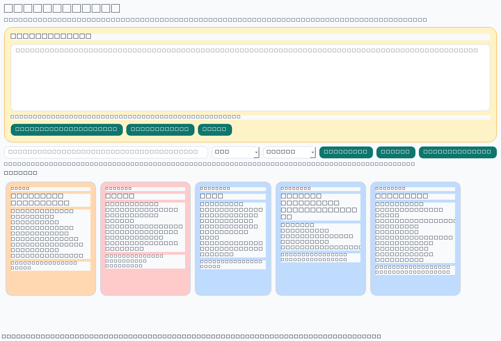
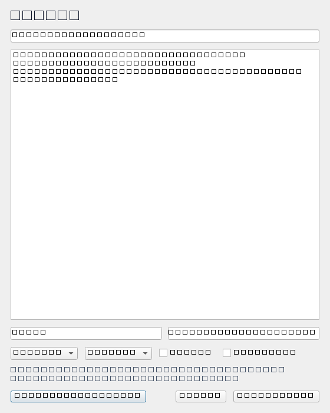

# Sticky Brain

Sticky Brain is a local-first Windows desktop app for capturing tiny operational details like API keys, service principals, AD group names, and pending tasks in searchable sticky notes.



Sticky Brain is built for the small operational details that are too messy for password managers, too temporary for ticket systems, and too important to lose in chat history.

## Open Source

Sticky Brain is released under the MIT license. See [LICENSE](LICENSE).

## Highlights

- Paste-first sticky note capture
- Automatic organization into title, category, tags, and sensitivity
- Local semantic search with a lightweight model
- Windows desktop packaging and installer scripts
- Local-only storage with no cloud dependency

## Screenshots

### Sticky board


### Sticky editor



## What it does

- Keeps notes in a local SQLite database
- Shows notes as colored sticky cards
- Supports fast keyword search
- Adds lightweight semantic search with a tiny local embedding model
- Works without any cloud dependency

## Why a tiny local model instead of a full LLM?

For note search, a compact local embedding model is a better fit than running a chat model all day. It uses much less memory and CPU while still understanding searches like:

- `prod azure service principal`
- `api key for billing`
- `pending ad group cleanup`

The app will download the small search model on first semantic-search use, then keep everything local on your machine.

## Development

```powershell
python -m pip install -r requirements.txt
python main.py
python scripts/generate_repo_assets.py
```

## Build

```powershell
python -m PyInstaller --noconfirm StickyBrain.spec
```

## Installer

```powershell
build_installer.bat
```

## Notes

- Data is stored locally in your Windows user app-data folder for Sticky Brain
- Semantic search falls back to keyword search if the local model is unavailable
- Notes are local but not encrypted yet, so treat the database like a local secrets file
- Set `STICKY_BRAIN_DB_PATH` if you want the app to use a custom database location
